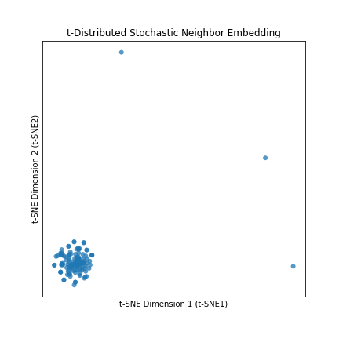
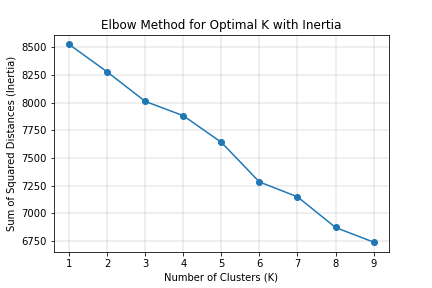

# Cryptocurrency Clusters

## Background

* On the Advisory Services Team of a financial consultancy, one of your clients—a prominent investment bank—is interested in offering a new cryptocurrency investment portfolio for its customers. The company, however, is lost in the vast universe of cryptocurrencies. They’ve asked you to create a report that includes what cryptocurrencies are on the trading market and determine whether they can be grouped to create a classification system for this new investment.

* You have been handed raw data, so you will first need to process it to fit the machine learning models. Since there is no known classification system, you will need to use unsupervised learning.

### Data Extraction

* Pull the data from [CryptoCompare](https://min-api.cryptocompare.com/data/all/coinlist) and load the columns `CoinName`, `Algorithm`, `IsTrading`, `ProofType`, `TotalCoinsMined`, and `MaxSupply`.

* Rename the column `MaxSupply` to `TotalCoinSupply`

### Data Transformation

* Discard all cryptocurrencies that are not being traded. In other words, filter for currencies that are currently being traded. Once you have done this, drop the `IsTrading` column from the dataframe.

* Remove all rows that have at least one null value.

* Filter for cryptocurrencies that have been mined. That is, the total coins mined should be greater than zero.

* In order for your dataset to be comprehensible to a machine learning algorithm, its data should be numeric. Since the coin names do not contribute to the analysis of the data, delete the `CoinName` from the original dataframe.

* Your next step in data preparation is to convert the remaining features with text values, `Algorithm` and `ProofType`, into numerical data. To accomplish this task, use Pandas to create dummy variables. Examine the number of rows and columns of your dataset now.

### Dimensionality Reduction

* Standardize your dataset so that columns that contain larger values do not unduly influence the outcome.

* Creating dummy variables above dramatically increased the number of features in your dataset. Perform dimensionality reduction with PCA. For this project, preserve 90% of the explained variance in dimensionality reduction.

* Further reduce the dataset dimensions with t-SNE and visually inspect the results. In order to accomplish this task, run t-SNE on the principal components: the output of the PCA transformation. Then create a scatter plot of the t-SNE output.

### Cluster Analysis with k-Means

* Create an elbow plot to identify the best number of clusters. Use a for-loop to determine the inertia for each `k` between 1 through 10. Determine, if possible, where the elbow of the plot is, and at which value of `k` it appears.

## Recommendations

Based on our KMeans elbow method, we would not recommend that the client invest in the current cryptocurrencies on the trading market as the cannot be grouped into a discernible classification system.

- - -

## References

Crypto Coin Comparison Ltd. (2020) Coin market capitalization lists of crypto currencies and prices. Retrieved from [https://www.cryptocompare.com/coins/list/all/USD/1](https://www.cryptocompare.com/coins/list/all/USD/1)